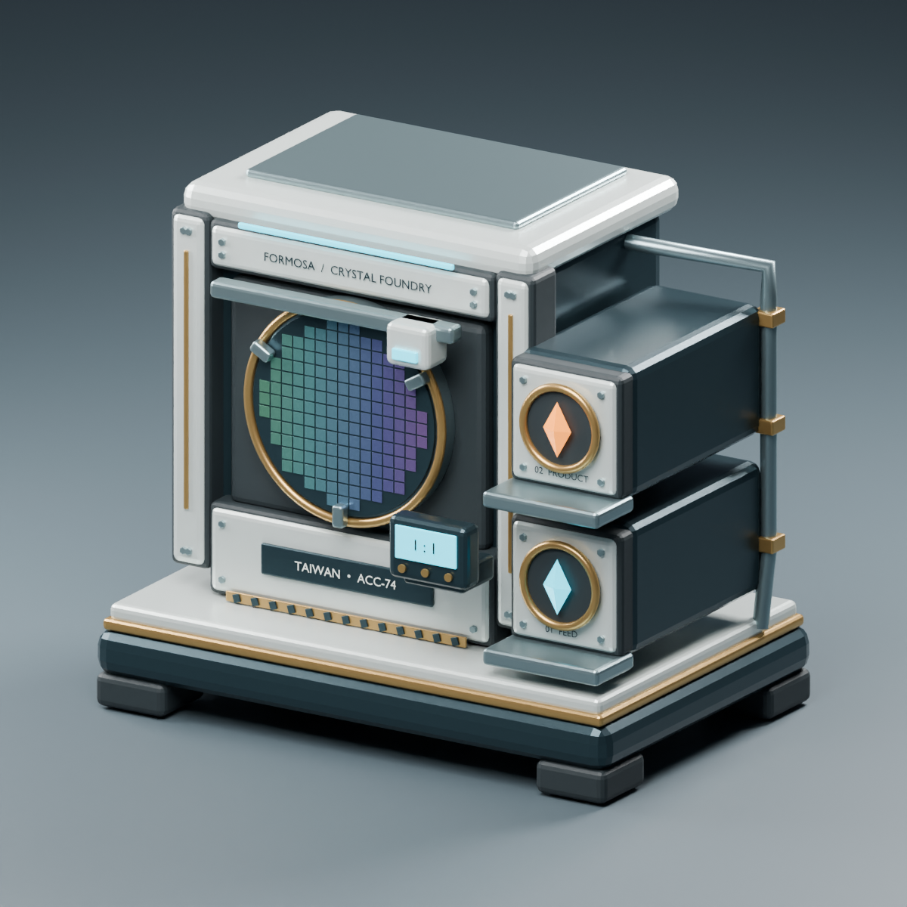

# Awakening Crystal Converter

大後期的屬性晶石轉換機：九屬性覺醒晶石 1：1 互換，以極高電力需求換取每秒一顆的便利。



## 用電代價

待機與運轉均固定耗電 **360,000／秒**，由原版能源系統處理。缺電暫停兌換，恢復供電後繼續；完成或取消訂單不降低耗電。

v0.6.2 移除定期物件掃描與能源重寫，工作燈改用原版事件通知。新版固定耗電平衡、讀檔後數值及事件燈號尚待遊戲內驗證；先前兩段耗電的測試不能代表新版平衡，也尚未證明 FPS 改善。

## 安裝與使用

需要 [UE4SS Experimental (Palworld)](https://steamcommunity.com/workshop/filedetails/?id=3625223587) 與 [PalSchema](https://steamcommunity.com/workshop/filedetails/?id=3625280368)。訂閱並在遊戲模組管理啟用依賴與本模組，完整重啟遊戲。

普通科技 74 級、3 點科技點，位於古代文明遺物轉換器旁。建材為帕魯樹晶錠 150、神秘木材 150、古代文明部件 90、古代文明核心 60；建造工作量欄位為 1,000,000。

先選想取得的屬性，再選支付晶石與數量。機器不需派工帕魯，使用基地電網；不儲存新帕魯、不計算 SAN 或適應性。舊封裝台只保留存檔相容與取回能力，不在科技或建造選單提供。

手動安裝：GitHub Release ZIP 內的 `Mods` 內容放入現有 UE4SS 的 `Mods` 目錄；不要同時啟用手動版與工坊版。移除前先備份存檔、領取物品，並在模組仍啟用時拆除建築。

## 語言與驗證範圍

17 種介面語言隨遊戲設定切換：English、繁體中文、简体中文、日本語、Français、Italiano、Deutsch、Español、Português (Brasil)、Русский、한국어、Bahasa Indonesia、Español (Latinoamérica)、ไทย、Türkçe、Tiếng Việt、Polski。改語言後完整重啟；機身字樣不變。

Windows Steam Palworld 1.0.4.102642 的單人核心流程已獲使用者實測接受：兌換、中途取消及領取、重開遊戲、完工未領重開、拆除返還、斷电停工與復電繼續、耗電平衡及模型建造顯示。v0.6.0 新增17語言已完成本機完整性與選單回歸測試，尚未逐一驗證遊戲版面。多人、專用伺服器及其他遊戲版本未驗證。

## 原始碼與建置

- `src/`：PalSchema 資料與 UE4SS Lua，包含舊存檔相容部分。
- `src/localization/strings.json`：17 語言來源；`tools/generate_localizations.ps1` 產生翻譯與 Lua 字串。
- `art/blender/`：Blender 可編輯模型、建模腳本、FBX 與原創渲染。此類模型以 Blender 製作。
- `unreal/`：Unreal 5.1 匯入、材質與建築 Blueprint 作者腳本。
- `tests/`：本機 Lua 行為測試，不替代遊戲測試。
- `tools/workshop-publisher/`：使用官方 uploader API 的發布工具，不包含憑證或第三方二進位。

建置需自備相容 Unreal 5.1、Palworld modding SDK、Blender 與 Lua 5.4。`tools/build_prototype.ps1` 的 `EngineRoot`、`SdkProject`、`SharedPluginRoot` 可指定本機工具鏈；依序執行 `-Stage Author`、`Cook`、`Package`。只打包 `/Game/PalAwakeningExchange` 自製資產，不提供遊戲或 SDK 檔案。

```powershell
./tools/generate_localizations.ps1 -Check
./tests/run.ps1 -Lua <path-to-lua.exe>
./tools/build_prototype.ps1 -Stage Package
./tools/package_workshop.ps1
```

原創程式碼、Blender 模型與美術採 [MIT](LICENSE) 授權。遊戲與第三方權利請見 [THIRD_PARTY_NOTICES.md](THIRD_PARTY_NOTICES.md)。非 Pocketpair 官方產品。

## 問題回報 / Issue reports

一般使用者可直接加入 [Discord「帕魯模組問題回報」](https://discord.gg/Cv94zj2BB)，也可使用本專案的 [GitHub Issues](https://github.com/paul800901/AwakeningCrystalConverter/issues)。請附模組名稱、Palworld 版本、模組版本、單人／多人／專用伺服器環境、重現步驟，以及相關 `UE4SS.log` 片段。請勿公開密碼、帳號資料或完整私人路徑。

General users can join [Palworld Mod Issue Reports on Discord](https://discord.gg/Cv94zj2BB), or use this project's [GitHub Issues](https://github.com/paul800901/AwakeningCrystalConverter/issues). Include the mod name, Palworld version, mod version, single-player/multiplayer/dedicated-server environment, reproduction steps, and relevant `UE4SS.log` excerpts. Do not post passwords, account information, or full private paths.
